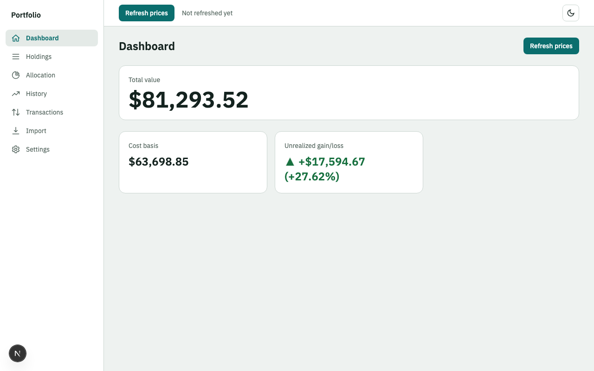
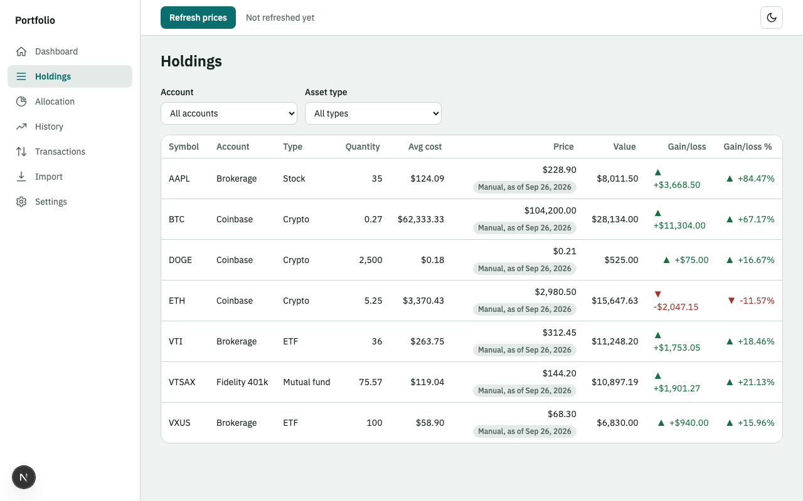

# Portfolio Manager

A personal, single-user portfolio tracker for stocks and ETFs, mutual and retirement funds, and crypto. You record your accounts and transactions, refresh prices on demand, and see your value, cost basis, gain or loss, allocation and history.

**Status:** Phase 1 (runs locally) is built. The cloud deployment (Phase 2) is planned and not done.





## Features (v1)

- Record holdings across accounts: stocks and ETFs, mutual funds and retirement accounts, crypto.
- Transactions: buy, sell, stock split (a ratio such as 2:1) and dividend reinvestment.
- Market value, cost basis and unrealized gain or loss, in dollars and percent, per holding and in total. Cost basis uses first-in, first-out lots.
- Refresh prices with one button. Yahoo Finance prices stocks, ETFs and funds; CoinGecko prices crypto. A failed feed keeps the last known price and marks it stale.
- Manual prices for anything a feed cannot price, such as a 401(k) fund.
- A daily portfolio snapshot each time you refresh, and a value-over-time chart from those snapshots.
- Allocation by asset type as a chart, compared with targets you set.
- CSV import with a preview and validation before anything is saved, and exports (transactions CSV, snapshots CSV, full JSON).

**Not in v1:** trading or order entry, rebalancing suggestions, tax lots or tax reports, dividends and realized gains, scheduled or automatic refresh, transaction fees, back-filling history from old prices, multiple currencies (everything is USD).

## Tech stack and architecture

Spring Boot (Java 21, Gradle) API, Next.js (App Router, TypeScript, Tailwind) web app, and Postgres 16. Details are in [the design spec](docs/spec.md).

```
Browser  →  Next.js  (UI + /api/* proxy route)  →  Spring Boot API  →  Postgres
                                                        ↓
                                              Yahoo Finance, CoinGecko
```

The browser only ever talks to the Next.js origin, so there is no CORS. The API is the only thing that calls the price feeds.

## Prerequisites

| Tool | Version | Check |
|---|---|---|
| JDK | 21 | `java -version`. On this Mac use `JAVA_HOME=/opt/homebrew/opt/openjdk@21`; `/usr/bin/java` is only a stub. |
| Node | 22 LTS via nvm | `node -v`. `nvm use` reads `.nvmrc`; the machine default (Node 25) is not supported. |
| Docker Desktop | running | `docker info` |
| Git | any recent | `git --version` |

Gradle comes from the wrapper (`./gradlew`); do not install it. The internet is needed only for real price refreshes; the tests never call a price feed. The API uses Spring Boot 4.1.1: starters are split (for example `spring-boot-starter-webmvc`), and JSON uses Jackson 3 (`tools.jackson.*`). Boot 3 examples may not apply.

## Quick start (local)

Follow these steps in order.

1. **Start Docker Desktop** and wait until it says it is running (`docker info` should print details, not an error).
2. **Free port 5432.** Postgres for this app uses `127.0.0.1:5432`. If another project's database container already uses it, stop that container first (`docker ps` shows it, `docker stop <name>` stops it).
3. **Get the code and open a terminal in it:**
   ```bash
   git clone <this repository> portfolio-manager
   cd portfolio-manager
   ```
4. **Set up the toolchain** (JDK 21 and Node 22) for this terminal. Do this in every new terminal:
   ```bash
   source scripts/env.sh
   java -version    # should say 21
   node -v          # should say v22
   ```
5. **Start everything:**
   ```bash
   scripts/dev.sh
   ```
   It starts Postgres, waits until it is healthy, then starts the API and the web app. The first run also installs the web dependencies and downloads Gradle, so it takes a few minutes. You should see, in order: the `db` container reported healthy, the API log line `Started ApiApplication`, and Next.js printing `Ready`.
6. **Open the app** at <http://127.0.0.1:3000>. It starts empty.
7. **Optional: load demo data.** To see the app with realistic data instead of an empty screen, leave `scripts/dev.sh` running and open a second terminal in the same folder:
   ```bash
   source scripts/env.sh
   scripts/seed-demo.sh
   ```
   It needs the API running (step 5) and `jq` installed (`brew install jq`). It adds three accounts, seven instruments, 21 transactions, manual prices and target allocations, then prints `Done`. Reload the page to see it. It refuses to run if the database already has transactions; to start clean first, stop the app and run `scripts/reset-db.sh` (it deletes all local data after you confirm), then start again from step 5. See "Demo data" below for more.
8. **Stop:** press Ctrl-C in the terminal running `scripts/dev.sh`. That stops the API and the web app. The Postgres container keeps running (your data stays); stop it with `docker compose down`, and add `-v` only if you also want to delete the data.

Next time, repeat steps 4 and 5 only (and step 1 if Docker is not running).

## Running the pieces manually

```bash
docker compose up -d db                                          # Postgres on 127.0.0.1:5432
cd api && ./gradlew bootRun --args='--spring.profiles.active=local'    # API on 127.0.0.1:8080
cd web && npm ci && npm run dev -- --hostname 127.0.0.1         # web on 127.0.0.1:3000
```

Everything binds to `127.0.0.1` only. Under the `local` profile the API refuses to start bound to anything else, and the app has no login, so never expose it beyond localhost.

## Configuration

Defaults work for local use; set a variable only to change one. `.env.example` lists the names (never commit real values).

| Variable | Used by | Default | Purpose |
|---|---|---|---|
| `API_BASE_URL` | web | `http://127.0.0.1:8080` | Where the `/api/*` proxy sends requests. |
| `APP_TIMEZONE` | API | `UTC` | Time zone that decides which date a snapshot belongs to. |
| `COINGECKO_API_KEY` | API | empty | Optional CoinGecko demo key; without it the free tier is used. |
| `SPRING_DATASOURCE_URL`, `SPRING_DATASOURCE_USERNAME`, `SPRING_DATASOURCE_PASSWORD` | API | `jdbc:postgresql://localhost:5432/portfolio`, `portfolio`, `portfolio` | Database connection. |
| `PROXY_SECRET`, `BOOTSTRAP_SECRET`, `WEBAUTHN_RP_ID`, `WEBAUTHN_ORIGIN`, `DATABASE_URL` | cloud | none | **Phase 2** only; not used locally. |

## Using the app (first 10 minutes)

1. **Settings → Add account:** for example a brokerage or a 401(k).
2. **Settings → Add instrument:** a stock or ETF by ticker; a crypto with its CoinGecko coin id (for example `bitcoin`); a fund that no feed prices, with the price source set to Manual.
3. **Transactions → Add transaction:** a buy, a sell, a split (enter the ratio, for example 2 new shares for 1 old) or a dividend reinvestment. A sell of more than you hold is rejected with the reason.
4. **Settings → Set price** on a manual instrument: the price and the date it is as of.
5. Click **Refresh prices**. It fetches prices, saves today's snapshot, and reports any instrument it could not price.
6. Read the **Dashboard**, **Holdings**, **History** and **Allocation** pages. Set **target allocation** on the Allocation page (targets must add up to exactly 100.00%).

History starts at your first refresh. A day you did not refresh has no point, and nothing is filled in afterwards.

## CSV import and export

Import a file from the **Import** page: you see every row's status first, and nothing is saved until you commit. Header row required, UTF-8, at most 2 MB and 5,000 rows.

| Column | Needed for | Values |
|---|---|---|
| `date` | always | `YYYY-MM-DD` |
| `account` | always | account name |
| `symbol` | always | ticker or coin symbol |
| `asset_type` | always | `STOCK`, `ETF`, `MUTUAL_FUND`, `CRYPTO` |
| `type` | always | `BUY`, `SELL`, `SPLIT`, `REINVEST` |
| `quantity`, `price` | buy, sell, reinvest | number above 0; price 0 or more, per unit |
| `split_ratio` | split | `n:m`, for example `2:1` |
| `source_id` | new crypto | CoinGecko coin id |
| `account_type` | optional | `BROKERAGE`, `RETIREMENT`, `CRYPTO`, `OTHER` (default) |
| `note` | optional | free text |

```csv
date,account,symbol,asset_type,type,quantity,price,split_ratio,source_id,account_type,note
2026-01-06,Brokerage,VTI,ETF,BUY,10,100,,,BROKERAGE,
2026-04-05,Brokerage,VTI,ETF,SPLIT,,,2:1,,,
2026-01-07,Coinbase,BTC,CRYPTO,BUY,0.5,40000,,bitcoin,CRYPTO,
```

A ready-made file is `web/public/sample-transactions.csv`. Rows identical to existing transactions are flagged and skipped unless you choose to include them.

**Exports** are on the Settings page: the transactions CSV (same schema, so it can be imported again), the snapshots CSV, and a full JSON backup. Export regularly. To restore, import the transactions CSV, then re-enter manual prices and targets; snapshot history cannot be restored from CSV.

## Demo data (optional)

`scripts/seed-demo.sh` fills a running local app with realistic data (three accounts, seven instruments, 21 transactions, prices and targets). It is off by default and refuses to run if the database already has transactions, unless you pass `--force`. `scripts/reset-db.sh` deletes everything, demo data included, after you confirm.

## Testing

| Command | Covers |
|---|---|
| `scripts/check.sh` | Everything below except end-to-end, plus formatting, lint, build and the privacy scan. Run before every milestone. |
| `cd api && ./gradlew test` | Domain unit tests and Testcontainers integration tests (Docker must be running). |
| `cd api && ./gradlew test --tests '*FifoEngineTest'` | A single class. |
| `cd web && npm run test` | Vitest unit and component tests. |
| `cd web && npm run lint` and `npm run build` | Lint and a production build. |
| `cd web && npx playwright test` | End to end. First run: `npx playwright install chromium`. |

The end-to-end tests start their own stack so they never touch your data: a separate `portfolio_e2e` database (recreated each run), the API on port 8081 with the `local` and `e2e` profiles (price feeds replaced by scriptable stubs), and the web app on port 3100. No test calls a live price API.

## Project structure

```
api/            Spring Boot API (Java 21, Gradle Kotlin DSL)
  src/main/java/com/portfoliomanager/
    domain/       pure money logic: FIFO engine, valuation, allocation
    persistence/  JPA entities and repositories
    application/  use-case services
    pricing/      price providers and the staleness policy
    importing/    CSV parsing and validation
    web/          controllers, DTOs, error handling
    e2e/          price stubs, only under the e2e profile
  src/main/resources/db/migration/   Flyway schema
web/            Next.js app (app/ routes, components/, lib/, e2e/ Playwright)
docs/           the documents listed below, and images/ for the screenshots
scripts/        dev, reset-db, check, seed-demo and the check scripts
docker-compose.yml   local Postgres
```

Documents: `docs/intent.md` (requirements), `docs/spec.md` (design), `docs/plan.md` (milestones), `docs/standards.md` (coding standards), `docs/acceptance-local.md` (Phase 1 acceptance record).

## Troubleshooting

| Symptom | Fix |
|---|---|
| "Unable to locate a Java Runtime" | `/usr/bin/java` is a stub. Run `source scripts/env.sh` (sets `JAVA_HOME` to JDK 21). |
| Wrong Node version, or build errors after an upgrade | `nvm use` in the repo (it reads `.nvmrc`, Node 22). |
| Port 5432, 8080 or 3000 already in use | Stop what holds it (`lsof -nP -iTCP:5432 -sTCP:LISTEN`), for example another project's Postgres container. |
| Database will not become healthy | Start Docker Desktop, then `docker compose up -d db` and check `docker compose ps`. |
| API refuses to start with a message about loopback | By design under the `local` profile: it must bind `127.0.0.1`. Do not override `server.address`. |
| Refresh shows stale badges, or `FAILED`, when offline or when Yahoo or CoinGecko is down | The last known prices are kept. Set a manual price in Settings to value a position meanwhile; refresh again later. |
| Flyway checksum mismatch | Never edit an applied migration; add a new one. For a development database, `scripts/reset-db.sh`. |
| Boot 4 differences (`tools.jackson` imports, starter names) | Follow the Spring Boot 4 documentation, not Boot 3 examples. |

## Cloud deployment (Phase 2)

Planned: the web app on Vercel and the API plus Postgres on Render, with passkey login. The runbook will be written as docs/deploy-cloud.md when that phase starts. Authentication is not enabled locally, and the `local` profile must never be exposed beyond localhost.

## Contributing

Follow `docs/standards.md`, including its review checklist. Work is one commit per task on `main`, with the task ID in the message (for example `M2-T5: transactions API with replay validation`), test first.

## License

A private personal project; no license is granted (decide before publishing).
