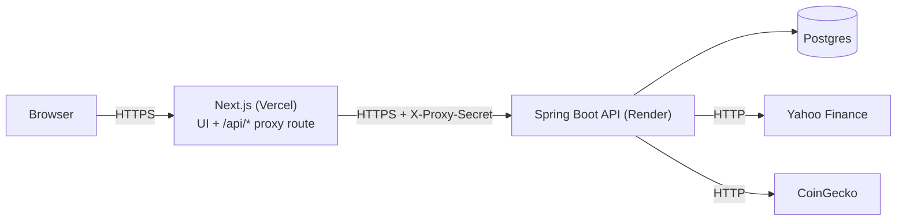
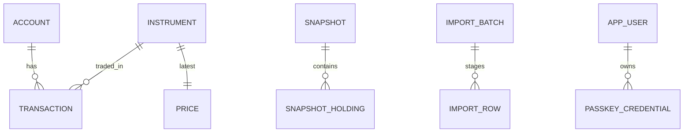
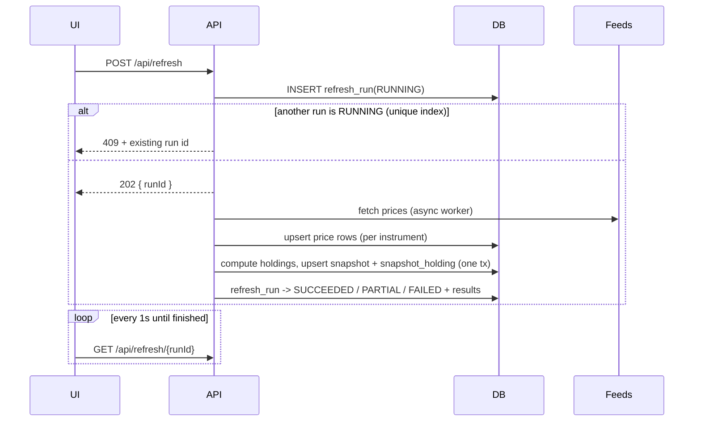

# Portfolio Manager: Architecture & Design Spec (v0.1)

Companion to [`intent.md`](./intent.md) (the product requirements). This document says *how* v1 is built. Where the two disagree, `intent.md` wins on scope and this file wins on mechanism.

## 1. Scope and phases

| Phase | What ships | Auth |
|---|---|---|
| 1. Local | Everything in `intent.md` v1 running on my machine: Spring Boot API, Next.js UI, Postgres in Docker. | None. API and UI bind to localhost only. |
| 2. Cloud | Same code deployed: Next.js on Vercel, Spring Boot + Postgres on Render. | Passkeys, proxy-only API access. |

Phase 1 is feature-complete for v1. Phase 2 adds only auth, the proxy hardening, and deployment configuration. No feature code should differ between phases; the difference is Spring profile (`local` vs `cloud`) and environment variables.

Out of scope (see `intent.md` §5): trading, tax lots/reporting, TWR/MWR, dividends and realized gains, rebalancing suggestions, multi-currency, scheduled refresh, snapshot backfill, broker-specific CSV parsers, cash balances, transfers between accounts.

## 2. Architecture



- **Browser** only ever talks to the Next.js origin. There is no CORS anywhere.
- **Next.js** serves the UI and a catch-all route handler `web/app/api/[...path]/route.ts` that forwards requests to the API, attaches `X-Proxy-Secret`, forwards cookies both ways, and streams the response. (A `next.config` rewrite cannot add request headers, so a route handler is used.)
- **Spring Boot API** owns all business logic, persistence, price fetching, and auth. It is a stateless-ish long-running process (sessions live in Postgres).
- **Postgres** is the single store. Flyway owns the schema.
- **Local topology:** the same route handler proxies `localhost:3000` to `127.0.0.1:8080`, so the request path is identical in both phases.

### Design principles
1. **Derive, don't store, what can be recomputed.** Lots, cost basis and holdings are replayed from transactions (single user, thousands of rows at most). Only prices and snapshots are stored, because they cannot be recomputed later.
2. **Exact arithmetic.** `BigDecimal` in Java, `NUMERIC` in Postgres, decimal *strings* in JSON. No floats anywhere.
3. **Pure domain core.** The FIFO engine and valuation logic are plain Java with no Spring/JPA imports and are unit-testable in isolation.
4. **A feed failure never breaks a page.** Last-known prices are always served; staleness is a flag, not an error.

## 3. Repository layout

```
portfolio-manager/
├── api/                          Spring Boot (Java 21, Gradle Kotlin DSL)
│   ├── build.gradle.kts
│   ├── Dockerfile
│   └── src/
│       ├── main/java/com/portfoliomanager/
│       │   ├── domain/           pure logic: Lot, FifoEngine, Valuation, Allocation, Money helpers
│       │   ├── persistence/      JPA entities + Spring Data repositories
│       │   ├── application/      services/use cases (HoldingsService, RefreshService, ...)
│       │   ├── pricing/          PriceProvider, YahooProvider, CoinGeckoProvider
│       │   ├── importing/        CsvParser, ImportValidator, ImportService
│       │   ├── auth/             WebAuthn, session, ProxySecretFilter
│       │   └── web/              REST controllers, DTOs, error handling
│       ├── main/resources/db/migration/   Flyway V1__*.sql ...
│       └── test/
├── web/                          Next.js (App Router, TS, Tailwind, Recharts)
│   ├── app/                      routes, layouts
│   ├── app/api/[...path]/route.ts   proxy to the API
│   ├── components/  lib/  (API client, formatters, zod schemas)
│   └── e2e/                      Playwright
├── docs/                         intent.md, spec.md
├── docker-compose.yml            local Postgres
└── README.md
```

Dependency rule inside `api`: `web → application → domain`, `application → persistence/pricing/importing`; `domain` depends on nothing.

## 4. Data model



All ids are UUIDs (`gen_random_uuid()`), except `transaction.seq` (bigserial, ordering). All money/quantity columns are `NUMERIC`: quantities and unit prices `NUMERIC(24,8)`, monetary totals `NUMERIC(20,4)`.

| Table | Columns (key ones) | Notes |
|---|---|---|
| `account` | `id`, `name` (unique), `type` (`BROKERAGE`/`RETIREMENT`/`CRYPTO`/`OTHER`), `created_at` | Accounts are containers only. |
| `instrument` | `id`, `symbol`, `name`, `asset_type` (`STOCK`/`ETF`/`MUTUAL_FUND`/`CRYPTO`), `price_source` (`YAHOO`/`COINGECKO`/`MANUAL`), `source_id` | Unique `(symbol, asset_type)`. `source_id` is the provider's key (Yahoo ticker, CoinGecko coin id such as `bitcoin`). Defaults: stock/ETF/fund → `YAHOO`, crypto → `COINGECKO`. |
| `transaction` | `id`, `seq`, `account_id`, `instrument_id`, `type` (`BUY`/`SELL`/`SPLIT`/`REINVEST`), `trade_date`, `quantity`, `unit_price`, `split_numerator`, `split_denominator`, `note`, `import_batch_id`, `created_at` | `seq` gives a stable replay order. BUY/SELL/REINVEST require quantity > 0 and unit_price ≥ 0. SPLIT requires both split fields > 0 and no quantity/price. Check constraints enforce this. Index `(account_id, instrument_id, trade_date, seq)`. |
| `price` | `instrument_id` (PK), `price`, `prev_price`, `price_date`, `fetched_at`, `status` (`OK`/`ERROR`), `last_error`, `manual_price`, `manual_as_of` | One row per instrument. On failure only `status`/`last_error` change; `price`/`fetched_at` keep the last good value. |
| `snapshot` | `snap_date` (PK), `total_value`, `total_cost_basis`, `priced_positions`, `stale_positions`, `unpriced_positions`, `updated_at` | One row per date. |
| `snapshot_holding` | `snap_date`, `account_id`, `instrument_id`, `quantity`, `price`, `value`, `cost_basis`, `is_stale` | PK `(snap_date, account_id, instrument_id)`. FKs use `ON DELETE CASCADE` on `snapshot` only; account/instrument FKs are `RESTRICT` (deleting an account with history is refused; see §9). |
| `target_allocation` | `asset_type` (PK), `target_pct` `NUMERIC(5,2)` | Empty table = no targets set. |
| `refresh_run` | `id`, `started_at`, `finished_at`, `status` (`RUNNING`/`SUCCEEDED`/`PARTIAL`/`FAILED`), `results` (jsonb) | Partial unique index on `(status) WHERE status = 'RUNNING'` = single-flight guard. |
| `import_batch` / `import_row` | batch: `id`, `filename`, `status` (`STAGED`/`COMMITTED`), `created_at`; row: `batch_id`, `line_no`, `raw` (jsonb), `parsed` (jsonb), `errors` (jsonb), `warnings` (jsonb) | Staging for the preview step. Staged batches older than 24h are purged when the next import starts. |
| `app_user` | `id`, `user_handle` (random 64 bytes), `created_at` | Exactly one row (cloud phase). |
| `passkey_credential` | `id`, `credential_id` (bytea, unique), `public_key_cose` (bytea), `sign_count`, `transports`, `label`, `created_at`, `last_used_at` | |
| Spring Session tables | created by Spring Session JDBC | Cloud profile only. |

Currency is implicit USD; there is no currency column (single-currency non-goal).

## 5. Domain logic

### 5.1 Positions and lots (FIFO)
A *position* is one `(account, instrument)` pair. `FifoEngine.replay(List<Txn>)` takes that pair's transactions ordered by `(trade_date, seq)` and returns the remaining lots plus any violation.

- **BUY / REINVEST:** append lot `{qty, unitCost = unit_price}`. (Reinvestment is a buy at the reinvestment price, entered by hand.)
- **SELL:** consume from the oldest lot forward until `qty` is satisfied; partially consumed lots keep their remainder at the original unit cost. Selling more than currently held is a violation, not a short position.
- **SPLIT n:m** (e.g., 2:1 → n=2, m=1): every open lot gets `qty × n/m` and `unitCost × m/n`. Total basis is unchanged. Splits apply only to lots opened on or before the split date, which is guaranteed by replay order.

Position outputs: `quantity = Σ lot.qty`, `costBasis = Σ lot.qty × lot.unitCost`, `avgCost = costBasis / quantity` (null if quantity is 0).

**Worked example.** BUY 10 @ 100 (Jan), BUY 10 @ 120 (Feb), SELL 15 (Mar), SPLIT 2:1 (Apr).

| Step | Lots (qty @ unitCost) | Basis |
|---|---|---|
| after Feb | 10 @ 100, 10 @ 120 | 2,200 |
| after Mar sell 15 | 5 @ 120 | 600 |
| after Apr split 2:1 | 10 @ 60 | 600 |

Rounding: intermediate arithmetic uses scale 8 with `RoundingMode.HALF_UP`; values shown or stored as money are rounded to scale 4 (UI shows 2). Summing is done on unrounded per-lot values and rounded once at the end, so totals do not accumulate rounding drift.

### 5.2 Validation on edit
Creating, editing or deleting a transaction re-replays that position's whole history. If the result has a violation (oversell at any point in time), the change is rejected with `422` naming the first offending transaction. This keeps historical edits safe (e.g., deleting an old buy that later sells depend on).

### 5.3 Valuation
For each open position with effective price `p`:
`value = quantity × p`, `unrealized = value − costBasis`, `unrealizedPct = unrealized / costBasis` (null if basis is 0).

Totals sum over **priced** positions only. Positions with no price at all are reported as `unpriced` and excluded from totals, with a count surfaced in the UI so totals are never silently wrong. Stale-priced positions are included (using last-known price) and counted as `stale`.

**Effective price:** if `instrument.price_source = MANUAL` → `price.manual_price`; else `price.price` (last good feed value).

**Day change:** `quantity × (price − prev_price)` when `prev_price` is known, summed over positions that have it; otherwise "n/a". Shown on the dashboard only when at least one position has it.

### 5.4 Allocation
Actual % per asset type = `Σ value(asset_type) / total priced value`. Target-vs-actual: `drift = actual% − target%`. Targets must sum to exactly 100.00 when saved (validated server-side); if none are set, the view shows actuals only.

## 6. Pricing subsystem

```java
interface PriceProvider {
    PriceSource source();                                    // YAHOO, COINGECKO
    Map<String, PriceResult> fetch(Collection<String> sourceIds);   // key = sourceId
}
record PriceResult(BigDecimal price, BigDecimal prevPrice, LocalDate priceDate, String error) {}
```

| Provider | Used for | Endpoint (all unauthenticated except CoinGecko demo key) | Notes |
|---|---|---|---|
| `YahooProvider` | stocks, ETFs, mutual funds | `GET https://query1.finance.yahoo.com/v8/finance/chart/{ticker}?range=5d&interval=1d` | Last close = `price`, prior close = `prevPrice`. One call per ticker, run concurrently (virtual threads, cap 5 in flight). Unofficial API: needs a browser-like `User-Agent` and can change without notice. There is no automatic fallback feed (decision, §15); on failure the price goes stale and the user can switch the instrument to `MANUAL`. |
| `CoinGeckoProvider` | crypto | `GET /api/v3/simple/price?ids={csv}&vs_currencies=usd&include_24hr_change=true&include_last_updated_at=true` with header `x-cg-demo-api-key` | One batched call for all coins. `prevPrice = price / (1 + change24h/100)`. Free tier ~30 calls/min, far above one call per refresh. |

**Behavior**
- Timeouts: 5s connect, 10s read. One retry with a 500 ms backoff on network errors/5xx. No retry on 4xx.
- A failed ticker sets `price.status = ERROR` and `last_error`, leaving the last good price and `fetched_at` untouched.
- **Staleness:** a price is *stale* if `status = ERROR` **or** `price_date` is more than 4 calendar days old (covers weekends/holidays without false alarms). Manual prices are stale if `manual_as_of` is more than 45 days old (retirement-fund NAVs update slowly; thresholds are constants in `StalenessPolicy`).
- Instruments with `price_source = MANUAL` are never sent to a provider. The user can flip a broken feed instrument to `MANUAL` as the fallback (`intent.md` §4).
- Only instruments with a currently open position are refreshed.

## 7. Refresh and snapshot flow

Refresh is asynchronous so the browser never waits on slow feeds, a Render cold start, or the Vercel function time limit.



**Steps in the worker**
1. Collect instruments with open positions; group by provider.
2. Fetch (Yahoo per ticker, CoinGecko batch). Each instrument's result is written to `price` in its own small transaction, so partial progress survives a crash.
3. Compute holdings from transactions + prices, then in **one transaction** upsert the `snapshot` row for today (`INSERT ... ON CONFLICT (snap_date) DO UPDATE`) and replace that date's `snapshot_holding` rows.
4. Finish the run: `SUCCEEDED` (all ok), `PARTIAL` (some instruments failed; snapshot still written using last-known prices, `is_stale` set), `FAILED` (no prices at all fetched **and** nothing written; existing snapshot untouched).

**Idempotency and concurrency**
- Snapshot key is the date, so repeated refreshes the same day rewrite the same rows.
- The partial unique index allows only one `RUNNING` run. A `RUNNING` row older than 5 minutes is treated as abandoned (process died) and is marked `FAILED` by the next request before it starts a new run.
- `snap_date` is computed in `app.timezone` (default `UTC`), configurable via env, not the server's zone. Note: a US-evening refresh lands on the next UTC date, so a snapshot's date can be one day ahead of the US market date.

**Failure UX**: the run result lists per-instrument outcomes (`symbol`, `ok`/`error`, message). The UI shows a banner for a `PARTIAL` run and a stale badge on affected rows; the dashboard renders normally in all cases.

## 8. CSV import

**Generic schema** (header row required, UTF-8, comma-separated, ≤ 2 MB / 5,000 rows):

| Column | Required | Values |
|---|---|---|
| `date` | yes | `YYYY-MM-DD` |
| `account` | yes | account name |
| `symbol` | yes | ticker or coin symbol |
| `asset_type` | yes | `STOCK`, `ETF`, `MUTUAL_FUND`, `CRYPTO` |
| `type` | yes | `BUY`, `SELL`, `SPLIT`, `REINVEST` |
| `quantity` | for BUY/SELL/REINVEST | decimal > 0 |
| `price` | for BUY/SELL/REINVEST | decimal ≥ 0, per unit |
| `split_ratio` | for SPLIT | `n:m`, e.g. `2:1` |
| `source_id` | for new `CRYPTO` instruments | CoinGecko coin id, e.g. `bitcoin` |
| `account_type` | no | for new accounts; default `OTHER` |
| `note` | no | free text |

**Stages**
1. `POST /api/imports` (multipart): parse and validate every row, stage into `import_batch`/`import_row`, and return the preview. Nothing touches real tables.
2. **Row validation:** required fields, enum/decimal/date parsing, and column rules per type. New accounts and instruments are marked *will create*. New crypto instruments without `source_id` are an error.
3. **Position validation:** the batch is virtually merged with existing transactions and each affected position is replayed; any oversell is reported against its CSV line.
4. **Duplicate warnings:** a row identical (account, instrument, date, type, quantity, price) to an existing transaction or to an earlier row in the file is flagged. By default flagged rows are skipped on commit, with a checkbox to include them.
5. `POST /api/imports/{id}/commit`: allowed only if no row has errors. Creates missing accounts/instruments and inserts all transactions in **one DB transaction** (all-or-nothing), preserving file order in `seq`. The import is then marked `COMMITTED`; re-committing returns `409`.

## 9. API design

REST + JSON, all under `/api`. Decimals are **strings** (`"12.50000000"`), dates ISO-8601, ids UUID. Errors use RFC 7807 `application/problem+json` with an `errors[]` array of `{field, message}` for validation failures.

| Area | Endpoints |
|---|---|
| Auth (cloud) | `GET /auth/status` · `POST /auth/register/options` · `POST /auth/register/verify` · `POST /auth/login/options` · `POST /auth/login/verify` · `POST /auth/logout` · `GET /auth/passkeys` · `DELETE /auth/passkeys/{id}` |
| Accounts | `GET/POST /accounts` · `PUT/DELETE /accounts/{id}` (delete refused with `409` if it has transactions) |
| Instruments | `GET/POST /instruments` · `PUT/DELETE /instruments/{id}` · `PUT /instruments/{id}/manual-price` `{price, asOf}` · `DELETE` same path to clear (delete refused with `409` if referenced) |
| Transactions | `GET /transactions?accountId&instrumentId&type&from&to&page&size` · `POST` · `PUT/DELETE /transactions/{id}` (re-validates by replay, §5.2) |
| Holdings | `GET /holdings?accountId&assetType&sort` → per-position rows |
| Dashboard | `GET /dashboard` → totals, day change, counts of stale/unpriced positions, last refresh info |
| Allocation | `GET /allocation` → actual, target, drift per asset type · `PUT /allocation/targets` |
| History | `GET /snapshots?from&to` → `[{date,totalValue,totalCostBasis}]` |
| Refresh | `POST /refresh` → `202 {runId}` or `409` · `GET /refresh/latest` · `GET /refresh/{id}` |
| Import | `POST /imports` · `GET /imports/{id}` · `POST /imports/{id}/commit` · `DELETE /imports/{id}` |
| Export | `GET /export/transactions.csv` (generic import schema, so it can be re-imported to rebuild positions) · `GET /export/snapshots.csv` · `GET /export/all.json` (accounts, instruments, transactions, manual prices, targets, snapshots) |
| Ops | `GET /api/actuator/health/liveness` (public, for Render health checks; exempt from the proxy-secret filter and returns no data) |

Example `GET /holdings` row:
```json
{ "accountId": "…", "accountName": "Fidelity 401k", "instrumentId": "…", "symbol": "VTSAX",
  "assetType": "MUTUAL_FUND", "quantity": "42.31500000", "avgCost": "101.2345", "price": "118.4000",
  "value": "5009.9796", "unrealized": "726.1210", "unrealizedPct": "16.9500",
  "priceStatus": "STALE", "priceAsOf": "2026-09-19" }
```
`priceStatus` ∈ `OK` | `STALE` | `MANUAL` | `MANUAL_STALE` | `UNPRICED`.

## 10. Frontend design

Stack: Next.js App Router, TypeScript, Tailwind, Recharts, SWR for data fetching, TanStack Table for the holdings/transactions tables, react-hook-form + zod for forms. Data is fetched client-side from `/api/*` so local and cloud behave identically; server components render only the shell and route guards.

| Route | Content |
|---|---|
| `/` Dashboard | Total value, cost basis, unrealized $/%, day change (if available), staleness/unpriced banner, **Refresh** button with progress and last-refreshed time, mini value chart. |
| `/holdings` | Sortable, filterable (account, asset type) table: symbol, qty, avg cost, price (with stale/manual badge), value, gain/loss $ and %. |
| `/history` | Line chart of `totalValue` (with cost basis as a second line) with range selector (1M/6M/1Y/All). Gaps are real: only days with a snapshot plot. Empty state explains that history starts at the first Refresh. |
| `/allocation` | Donut of actual allocation by asset type; table of actual vs target vs drift; inline target editor (must sum to 100). |
| `/transactions` | Filterable list, add/edit/delete form (type-aware fields). |
| `/imports` | Upload, preview table (row status: ok / will-create / warning / error), commit. Link to the schema documentation. |
| `/settings` | Accounts, instruments (price source, source id, manual price), passkeys (cloud), **Export data** buttons (transactions CSV, snapshots CSV, full JSON) with a "last exported" reminder. |
| `/login` (cloud) | Passkey login; first-time enrollment flow with bootstrap secret. |

UI rules: responsive down to ~400px (tables scroll horizontally in their own container); all money right-aligned, tabular figures, negatives in red with a sign (not color alone); stale prices show a badge with the as-of date; every list has a real empty state. Number formatting uses `Intl.NumberFormat` on the decimal strings, parsed with a decimal-safe helper for display only (no arithmetic in the browser).

## 11. Security

**Local profile** (`SPRING_PROFILES_ACTIVE=local`): all endpoints open; `server.address=127.0.0.1`. Startup fails if the profile is `local` and the bind address is not loopback, so it cannot be exposed by accident.

**Cloud profile** (`cloud`):
1. **Proxy-only access.** `ProxySecretFilter` (first in the chain) requires header `X-Proxy-Secret` equal to env `PROXY_SECRET`, compared in constant time, on every request except the liveness probe. Direct hits to the public `onrender.com` URL get `403`. The secret lives in Vercel and Render env vars only. CORS is disabled.
2. **Passkeys** via Yubico `webauthn-server-core`. `WEBAUTHN_RP_ID` and `WEBAUTHN_ORIGIN` come from env (the Vercel/custom domain the browser sees), never from request headers. User verification is `required`, resident keys `preferred`.
3. **Enrollment and recovery.** Registering a passkey requires either an authenticated session (adding another device) or the bootstrap secret `BOOTSTRAP_SECRET` in the request body. That covers first-time setup (nobody can claim a fresh deployment without the secret) and recovery (lost every passkey → supply the secret and enroll a new one; then rotate the secret). Failed secret attempts are rate limited (5 per 15 minutes) and constant-time compared.
4. **Sessions.** Spring Session JDBC, cookie `HttpOnly; Secure; SameSite=Lax`, 14-day idle timeout. CSRF: Spring Security's cookie-based double-submit token; the web client echoes it in `X-XSRF-TOKEN`; the proxy route forwards cookies and headers unchanged.
5. **All non-auth endpoints require a session**; unauthenticated calls return `401` and the UI redirects to `/login`. Next.js middleware only checks cookie presence for redirect ergonomics; the API is the authority.
6. **Data protection.** TLS on both hops (Vercel, Render) and to Postgres over Render's private URL. Encryption at rest relies on the platform's disk encryption (verify this in Render's docs before storing real data). No broker credentials are ever stored. No analytics or third-party scripts; the only outbound calls are the price providers, from the API.
7. **Secrets** (`PROXY_SECRET`, `BOOTSTRAP_SECRET`, `COINGECKO_API_KEY`, DB URL) exist only in platform env vars/`.env` files that are git-ignored. Logs must not include request bodies or the secrets.

## 12. Deployment

**Local**
```
docker compose up -d db                  # Postgres 16
cd api && ./gradlew bootRun              # profile=local, 127.0.0.1:8080, Flyway migrates on start
cd web && npm run dev                    # 127.0.0.1:3000, API_BASE_URL=http://127.0.0.1:8080
```

**Cloud**
- **Render web service** (Docker): multi-stage `api/Dockerfile` (Gradle build → Eclipse Temurin 21 JRE, layered jar), `-XX:MaxRAMPercentage=70`, lazy bean init to fit small instances. Health check path `/api/actuator/health/liveness`. Render's Postgres connection string is `postgres://…`; a small config shim converts it to the JDBC URL. Flyway runs on startup.
- **Render Postgres:** same region as the web service (private network URL).
- **Vercel project** rooted at `web/`, env: `API_BASE_URL` (Render service URL), `PROXY_SECRET`.
- **Env vars (API):** `SPRING_PROFILES_ACTIVE=cloud`, `DATABASE_URL`, `PROXY_SECRET`, `BOOTSTRAP_SECRET`, `WEBAUTHN_RP_ID`, `WEBAUTHN_ORIGIN`, `COINGECKO_API_KEY`, `APP_TIMEZONE`.
- **Cold starts:** on Render's free tier the API sleeps when idle, so the first request after a pause is slow (JVM startup). The UI shows a "waking up the server…" state after 3 s of pending requests. This is acceptable because refresh is user-initiated and async.
- **Limits to respect:** Vercel functions cap request bodies at about 4.5 MB, so the CSV limit is 2 MB. The v1 cloud deployment uses Render's free tier, and free Postgres is time-limited and can be deleted after expiry. The manual export (§9) is the only backup, so export regularly (see §15).

## 13. Testing strategy

| Layer | Tooling | What is covered |
|---|---|---|
| Domain unit | JUnit 5 + AssertJ | `FifoEngine`: multi-lot sells, partial lot consumption, oversell violation, splits (2:1, 1:10 reverse), reinvest, same-day ordering, rounding. Valuation: unpriced/stale handling, day change. Allocation and drift. Property-style check: basis never negative, quantity never negative. |
| Persistence/integration | Spring Boot Test + Testcontainers (Postgres 16) | Flyway migrations apply; snapshot upsert idempotency; single-flight `refresh_run` index; delete/`RESTRICT` rules; check constraints. |
| Providers | WireMock with recorded fixtures | Yahoo/CoinGecko parsing, error and timeout paths, batching. No live network in CI. |
| API | MockMvc | Validation errors (problem+json), replay-on-edit `422`, holdings/dashboard JSON, import staging and commit, refresh 202/409. Auth: proxy-secret filter, `401`s, enrollment rules (cloud profile tests). |
| Architecture | ArchUnit (runs in `./gradlew test`) | Layering rule: `domain` imports nothing from Spring/JPA/Jackson; `web → application → domain`. |
| Frontend unit | Vitest + Testing Library | Formatters, forms, table sorting/filtering, stale badges. |
| End-to-end | Playwright against local stack with stubbed providers (`e2e` profile) | Golden path (below), failure path, import path, offline path. |
| Accessibility | Playwright + axe | No serious/critical violations on every page in both themes; keyboard-only transaction entry; no page-level horizontal scroll at 400 px. |
| Privacy/network audit | Playwright + build grep | Browser makes requests only to its own origin; no analytics or CDN references in the build (`intent.md` NFR-PRIV-1). |
| Offline check | Stubbed unreachable providers, plus a manual run with Wi-Fi off | Refresh reports `FAILED`/`PARTIAL`, stale badges, everything else usable, manual-priced instruments still value. |
| Docs check | `scripts/check-readme-links.sh` | Every relative link and path in `README.md` exists; README followed literally from a clean clone reaches a working dashboard. |

**Gate:** `scripts/check.sh` (API tests, web tests, lint, build) must be green before each milestone closes; the touched subproject's full suite must be green before every commit. No test calls a live price API.

**Golden path (end-to-end).** Create an account; create an ETF, a crypto (with CoinGecko id), and a manual-priced fund; enter buys, a partial sell, and a split; set the manual price; click Refresh with stubbed prices. Assert: dashboard totals and per-holding gain/loss; allocation percentages; exactly one history point. Click Refresh again and assert it is still one point.

**Mapping to `intent.md` §9 verification**

| Verification item | Test |
|---|---|
| Real broker CSV totals match statement | Manual acceptance with my own export reshaped to the schema; plus an automated import fixture with known expected totals. |
| Crypto + ETF + manual-priced fund appear with correct gain/loss | Playwright golden path; API test on `/holdings`. |
| FIFO remaining basis and split | `FifoEngine` unit tests (§5.1 example is a test case). |
| Target allocation renders | API test on `/allocation`; Playwright check on `/allocation`. |
| Refresh creates/updates one snapshot; API failure shows stale without breaking dashboard | Integration test (double refresh → one row); provider-failure test; Playwright with a failing stub. |
| Chart reflects snapshots | Playwright: seed snapshots, assert chart points. |
| Local phase works | Whole suite runs against the local profile. |
| Cloud: unreachable without login; API rejects non-proxied calls; passkeys through proxy | Cloud-profile API tests; manual smoke test on the deployed pair (register, logout, login, direct API hit → 403). |

## 14. Build order and risks

**Milestones** (each ends with passing tests; the detailed tasks and requirement mapping are in [`plan.md`](./plan.md))
1. **M0 Scaffold:** monorepo, `docker-compose.yml`, Gradle project, Next.js app, proxy route, Flyway V1, health check, dev scripts.
2. **M1 Domain core:** `FifoEngine`, valuation, allocation, staleness policy, with the full unit suite.
3. **M2 Data entry and holdings:** accounts, instruments, transactions, holdings and dashboard endpoints; design system and core screens.
4. **M3 Pricing, refresh, snapshots:** providers, async refresh, snapshot writing, stale indicators, history chart.
5. **M4 CSV import and export:** schema, staging, preview UI, commit, exports.
6. **M5 Allocation:** allocation view and target editor.
7. **M6 Local hardening and acceptance:** end-to-end, accessibility, privacy audit, demo data, README, acceptance record. *(Phase 1 complete; you sign off before M7.)*
8. **M7 Cloud auth:** proxy-secret filter, passkeys, sessions, bootstrap-secret recovery.
9. **M8 Cloud deployment:** Dockerfile, Render + Vercel setup, deployed smoke test, backup runbook. *(Phase 2 complete.)*

**Risks**
| Risk | Mitigation |
|---|---|
| Yahoo's unofficial API changes or blocks requests | Isolated behind `PriceProvider`; no automatic fallback, so manual override is the escape hatch; provider fixtures make breakage easy to spot. |
| Mutual fund NAVs not on Yahoo | `MANUAL` price source with staleness warning at 45 days. |
| Passkeys through a proxy across two platforms | RP ID/origin pinned by env; test locally in M7 (virtual authenticator) before any deployment, then again on a throwaway deployment before real data. |
| Render free tier limits (sleep, Postgres expiry) | Cold-start UX state; regular manual export (re-importable CSV); revisit a paid database if the data becomes hard to recreate. |
| Snapshot gaps because refresh is manual | Accepted trade-off of the on-demand decision; chart shows only real points. |

## 15. Decisions on earlier open questions

| Question | Decision |
|---|---|
| Transaction fees/commissions | Not modeled in v1. Basis = quantity × price, so totals may differ slightly from broker statements when fees exist. |
| Render tier and backups | Free tier (API sleeps when idle; free Postgres is time-limited). Backup is manual export only (§9, §10). Restore = re-import the transactions CSV and re-enter manual prices and targets. Snapshot history is not restorable from CSV in v1. |
| Price feed fallback | None. Yahoo only for stocks/ETFs/funds; on failure prices go stale and the user can set a manual price. |
| Snapshot timezone | UTC. |
| Custom domain | Use `*.vercel.app` for now. If the domain changes, passkeys must be re-enrolled with the bootstrap secret. |
| CSV parsing | Apache Commons CSV (a library, not a hand-written parser), wrapped in `importing.CsvParser`. BOM stripping and the 2 MB / 5,000-row limits are enforced by our wrapper. |

## 16. Open questions

- **Snapshot restore:** should the JSON export be importable (full restore including snapshots), given the free-tier database can expire? Not in v1 as written.
- **Free Postgres expiry:** check Render's current free-database lifetime before storing real data, and set a calendar reminder to export before it lapses.
